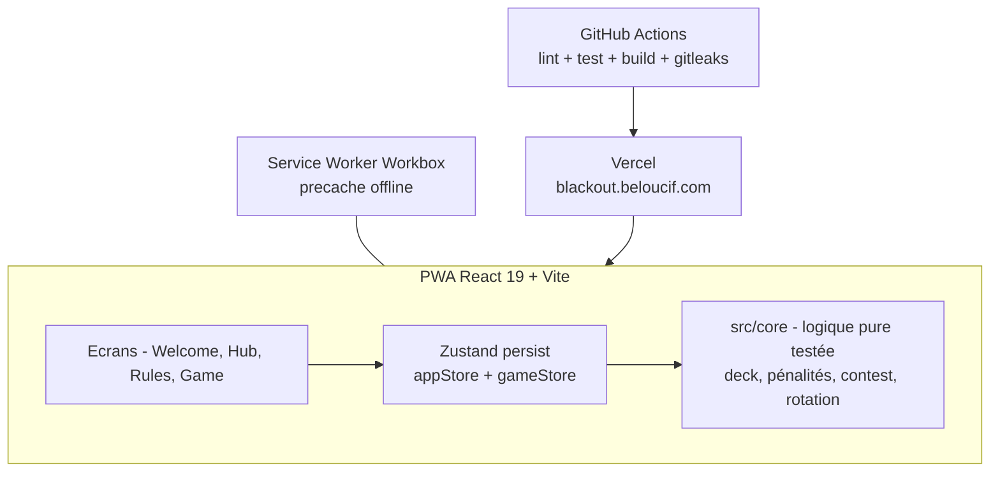

# BlackOut

[](https://github.com/Adam-Blf/black-out/releases)

<!-- adam-badges:start -->
[](https://github.com/Adam-Blf/black-out/commits) [](https://hits.sh/github.com/Adam-Blf/black-out/) [](https://github.com/Adam-Blf/black-out/commits) [](https://github.com/Adam-Blf/black-out) [](LICENSE)
<!-- adam-badges:end -->


Collection de jeux à boire, PWA installable, hors ligne. Live : [blackout.beloucif.com](https://blackout.beloucif.com)

## Le Borderland

**52 cartes, 4 règles, 0 pitié.**

Tire une carte, découvre son pouvoir. Distribue des gorgées, ou bois-les. Conteste si tu oses.

| Couleur | Règle | Description |
|---------|-------|-------------|
| Trèfle | Le Guess | Carte face cachée. Un joueur devine la valeur. S'il a juste, tu distribues. Sinon, il boit. |
| Carreau | L'Action | Donne une action au joueur de ton choix. |
| Coeur | La Question | Pose une question au joueur de ton choix. |
| Pique | La Contrainte | Donne une contrainte à accomplir au joueur de ton choix. |

Contest avec escalade : niveau 1 = x1, niveau 2 = x2, niveau 3 = x4. **As = SHOT**, autres cartes = gorgées (valeur de la carte).

## État des features

- [x] Check-in des joueurs (2-8, persistés en localStorage)
- [x] Jeu de cartes Le Borderland complet (contest, stats, récap de session)
- [x] Haptique + raccourcis clavier
- [x] PWA installable, mode hors ligne
- [x] Tests unitaires sur la logique de jeu (Vitest)
- [x] CI GitHub Actions (lint, tests, build, gitleaks)
- [ ] Modes supplémentaires (Picolo-like, Action ou Vérité, Je n'ai jamais, Qui de nous, C'est un 10 mais, Le Tribunal, Roulette) - moteur en cours
- [ ] Rebranding Neo-Tokyo Borderland
- [ ] Abonnement premium (packs de contenu)

## Installation

```bash
git clone https://github.com/Adam-Blf/black-out.git
cd black-out
npm install
npm run dev
```

| Commande | Description |
|----------|-------------|
| `npm run dev` | Serveur de développement |
| `npm run build` | Build production (tsc + vite) |
| `npm run lint` | ESLint 9 |
| `npm run test` | Vitest (watch) |
| `npm run test:run` | Vitest (one shot, CI) |

## Architecture



## Tech stack

| Technologie | Usage |
|-------------|-------|
| React 19 + TypeScript 5.7 | UI |
| Vite 6 | Build |
| Tailwind CSS 3.4 | Styling |
| Framer Motion 12 | Animations |
| Zustand 5 | State (persist localStorage) |
| Vitest | Tests logique de jeu |
| vite-plugin-pwa | PWA + Service Worker |
| Vercel | Hébergement + previews |

## Déploiement

Vercel, automatique depuis `main`. Domaine : CNAME `blackout` vers `cname.vercel-dns.com` (zone DNS OVH).

## Changelog

Voir [CHANGELOG.md](CHANGELOG.md).

## Licence

[MIT](LICENSE) - Adam Beloucif

---

*À consommer avec modération.*
