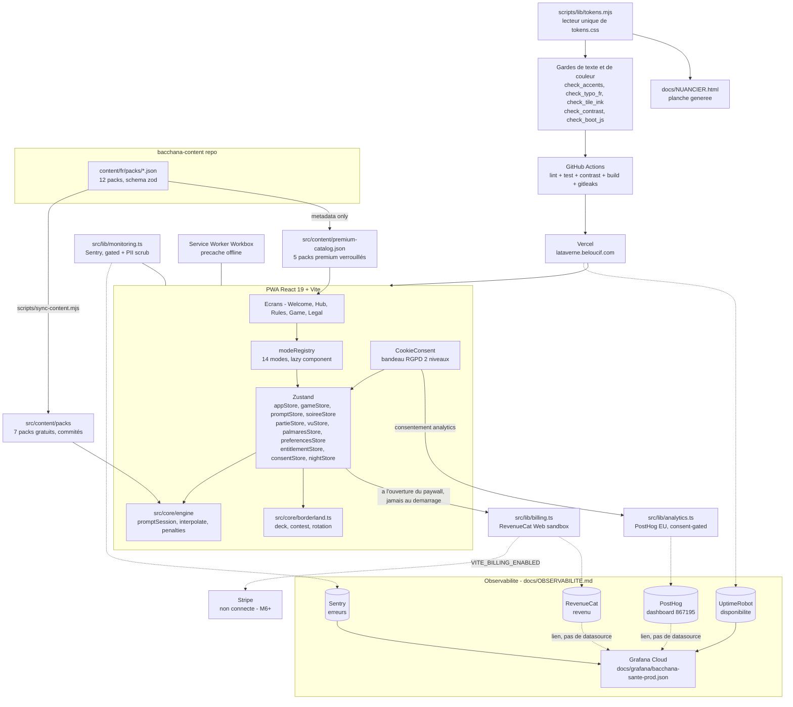

# Bacchana

[](https://github.com/Adam-Blf/bacchana/releases)

<!-- adam-badges:start -->
[](https://github.com/Adam-Blf/bacchana/commits) [](https://hits.sh/github.com/Adam-Blf/bacchana/) [](https://github.com/Adam-Blf/bacchana/commits) [](https://github.com/Adam-Blf/bacchana) [](LICENSE)
<!-- adam-badges:end -->


Les meilleurs jeux de soirée, réunis dans une seule app. PWA installable, hors ligne. Live : [bacchana.beloucif.com](https://bacchana.beloucif.com)

> `lataverne.beloucif.com` sert encore le même contenu en 200, sans redirection.
> Une canonique est déclarée dans `index.html`, mais la redirection 301 reste à
> poser côté Vercel : une canonique est un signal, pas une règle.

Direction artistique **« Tirage de nuit »** (2026-08-30, remplace le néobrutalisme) : aplat pourpre `#5B2C87`, celui du logo, deux encres, une surimpression jaune, un filet gravé d'un point. Aucune ombre, aucun flou, aucun dégradé. Trois thèmes, dont un mode daltonien. Typo **Big Shoulders Display / Chivo**, plus Space Mono sur le ticket de l'addition (auto-hébergées, zéro CDN).

La source de vérité est le fichier Figma `yw0aNHttIR5oWAw3k2VEiC` ; `src/styles/tokens.css` en est le report, et `docs/DESIGN_TOKENS.md` est GÉNÉRÉ depuis ce CSS par `scripts/gen_design_tokens_doc.mjs`. Brand book marketing : [`docs/BRAND.md`](docs/BRAND.md). Design system technique : [`design-system/bacchana/MASTER.md`](design-system/bacchana/MASTER.md). Palette détaillée (web + portage Android/iOS) : [`docs/DESIGN_TOKENS.md`](docs/DESIGN_TOKENS.md).

L'univers narratif du jeu (la taverne, le comptoir, le taulier, la tablée, la pénalité) reste inchangé - seul le nom du produit est devenu Bacchana (2026-08-04, ex-« La Taverne »).

L'application distribue des pénalités abstraites, le groupe décide de leur nature. Aucun contenu n'encourage la consommation d'alcool.

## Borderland

**52 à 156 cartes, 4 règles, 2 jokers par paquet, 0 pitié.**

Tire une carte **face cachée**, fais deviner sa valeur, retourne-la, découvre son pouvoir.
Distribue des pénalités, ou prends-les. Conteste si tu oses. Options : 1 à 3 paquets,
jokers (carte blanche), mode cartes aléatoires à l'infini (premium).

| Couleur | Règle | Description |
|---------|-------|-------------|
| Trèfle | Le Guess | Avant de retourner la carte, un joueur devine sa valeur. S'il a juste, tu distribues. Sinon, il prend la pénalité. |
| Carreau | L'Action | Donne une action au joueur de ton choix. |
| Cœur | La Question | Pose une question au joueur de ton choix. |
| Pique | La Contrainte | Donne une contrainte à accomplir au joueur de ton choix. |

Contest avec escalade : niveau 1 = x1, niveau 2 = x2, niveau 3 = x4. **As = PÉNALITÉ MAJEURE**, autres cartes = pénalités (valeur de la carte).

## Modes de jeu

Moteur multi-modes générique (`src/core/engine`) qui pilote 13 modes depuis un registre central,
chacun avec son écran chargé en lazy loading :

| Mode | Type | Contenu |
|------|------|---------|
| Borderland | Jeu de cartes dédié | 1-3 paquets + jokers, logique propre (`src/core/borderland.ts`) |
| Quitte ou Double | Écran dédié + moteur pur | Quiz culture G à cagnotte (`quizSession.ts`, 60 questions) |
| Le Tableau d'Honneur | Écran dédié + moteur pur | Classement secret du juge, la table devine la question (`rankingSession.ts`, 40 questions) |
| La Criée | Logique embarquée | Surenchères sur un thème, défi « tu mens ! » 60 s (50 thèmes) |
| Le Taulier (picolo) | Session de prompts | Pack gratuit + pack premium verrouillé |
| Action ou Vérité | Session de prompts | Pack gratuit + pack premium verrouillé |
| Je n'ai jamais | Session de prompts | Pack gratuit + pack premium verrouillé |
| Qui de nous | Session de prompts | Pack gratuit + pack premium verrouillé |
| Tu préfères | Session de prompts | Pack gratuit |
| C'est un 10 mais | Session de prompts | Pack gratuit + pack premium verrouillé |
| 7 Secondes | Session de prompts | Pack gratuit |
| Le Pilori | Logique embarquée | Accusations écrites par les joueurs (ou par l'app), défense, vote à main levée |
| La Roue du Destin | Logique embarquée | Roue à 8 segments + segments personnalisés (« Mes règles ») |

Le contenu (packs FR) vient du repo `bacchana-content` : les packs gratuits sont synchronisés en
JSON commité (`npm run sync-content`), les packs premium restent hors du repo public - seule leur
métadonnée alimente les tuiles verrouillées du hub, en attendant l'entitlement Supabase (M6).

## État des features

- [x] Check-in des joueurs (2-8, repris 4 h après un rafraîchissement) : une chaise laissée sans nom et deux prénoms identiques sont signalés, avec la correction proposée
- [x] Jeu de cartes Borderland complet (contest, stats, récap de session)
- [x] Moteur multi-modes (registre de 14 modes, session de prompts générique, règles persistantes/rôles)
- [x] 6 modes de prompts jouables (Le Taulier, Action ou Vérité, Je n'ai jamais, Qui de nous, C'est un 10 mais, 7 Secondes) + 7 modes embarqués (Borderland, La Criée, Le Pilori, Le Tableau d'Honneur, Quitte ou Double, La Roue du Destin, Tu préfères à vote)
- [x] Le Tribunal et La Roue du Destin (logique embarquée, sans pack de contenu)
- [x] Pipeline de contenu (`scripts/sync-content.mjs`) + validation zod alignée sur le schéma `bacchana-content`
- [x] Gating premium (stub `entitlementStore`, tuiles verrouillées, modale "bientôt")
- [x] Haptique + raccourcis clavier
- [x] PWA installable, mode hors ligne
- [x] Tests unitaires sur la logique de jeu et le moteur multi-modes (Vitest)
- [x] CI GitHub Actions (lint, tests, build, gitleaks)
- [x] Rebranding « La Taverne » (néobrutalisme, logo + jeu complet d'icônes iOS/Android) - **remplacé** par « Tirage de nuit » le 2026-08-30
- [x] Rebranding produit « Bacchana » (2026-08-04) : nom d'app, manifest PWA, écrans, pages légales,
      migration localStorage, univers narratif (taverne, taulier, tablée) inchangé
- [x] Refonte du thème sombre (2026-08-04) : hiérarchie d'élévation à 4 paliers, bordures
      renforcées (alpha 0.20 -> 0.38), nouveau token `danger` séparé de `card-red`, voir
      [`docs/DESIGN_TOKENS.md`](docs/DESIGN_TOKENS.md)
- [x] Navigation robuste : couche history/popstate (retour matériel in-app), fermeture des modales au retour, zéro écran noir, safe-area sur tous les contrôles fixes
- [x] Règles personnalisées « Mes règles » (persistées sur l'appareil, injectées dans les jeux)
- [x] 4 nouveaux modes : Quitte ou Double, Le Tableau d'Honneur, La Criée, Procès avec accusations des joueurs
- [x] Borderland (ex-Borderland) : 1-3 paquets, jokers, mode infini premium, 52 cartes au design unique
- [x] Pages légales (mentions légales, politique de confidentialité, CGU/CGV) + bandeau de
      consentement cookies RGPD (2 niveaux, refus aussi simple que l'acceptation, `consentStore`)
- [x] Analytics produit consenti (PostHog EU, `src/lib/analytics.ts`) - zéro traceur avant choix
      explicite, événements `mode_started` / `session_completed` / `premium_paywall_viewed` /
      `consent_updated` / `session_abandoned` / `item_resolved` / `subscribe_started` /
      `subscribe_completed` / `subscribe_failed`
      (entonnoir premium complet, voir [`docs/posthog/insights.json`](docs/posthog/insights.json))
- [x] Infra premium réelle (RevenueCat Web sandbox, `src/lib/billing.ts` + `entitlementStore`) -
      modale paywall avec prix live si disponible, achat réel désactivé derrière
      `VITE_BILLING_ENABLED` en attendant la connexion Stripe
- [x] Onboarding premier lancement (3 panneaux, une seule fois, skippable)
- [x] Règles par mode : les 14 modes documentés in-app, en SURCOUCHE (une navigation démontait l'écran de jeu et perdait la partie)
- [x] Fin de session sur tous les modes (La Criée, La Roue et Tu préfères inclus)
- [x] Crash reporting Sentry (gated par `VITE_SENTRY_DSN`, erreurs uniquement, zéro PII,
      scrub `beforeSend`/`beforeBreadcrumb`, `environment` séparé du build) -
      voir [`docs/MONITORING.md`](docs/MONITORING.md)
- [x] Garde de contraste WCAG 2.1 (`scripts/check_contrast.mjs`, branché en CI) : texte sur les
      aplats de tuile `aplat-1` à `aplat-4` fixé sur le token `tile-ink`, plus lisible en
      thème sombre (voir [`docs/DESIGN_TOKENS.md`](docs/DESIGN_TOKENS.md))
- [x] Observabilité prod : dashboard Grafana importable (Sentry + UptimeRobot),
      insights PostHog scriptés (`npm run posthog:setup`) - runbook complet dans
      [`docs/OBSERVABILITE.md`](docs/OBSERVABILITE.md)
- [x] Chronomètre de « 7 Secondes » (le mode promettait sept secondes et n'en comptait aucune)
- [x] Reprise après rafraîchissement : tablée, manche, ardoise, enchaînement et écran, avec
      péremption à 4 h et empreinte de tablée (voir « Ce qui survit » plus bas)
- [x] Anti-répétition des cartes sur toute la soirée, et longueur de manche réglable
      (le paquet entier valait 81 questions avant l'addition, donc l'écran de fin était hors
      de portée)
- [x] Palmarès de la maison, indexé par prénom, sans compte ni serveur, sans péremption
- [x] Addition partagée en IMAGE (le ticket de caisse lui-même, dessiné au canevas) et non
      en texte
- [x] Thème daltonien atteignable : il vivait dans `tokens.css` depuis le 30/08 sans qu'aucun
      chemin ne puisse le poser
- [x] Nuancier généré depuis les jetons (`npm run nuancier`), trois thèmes, contrastes mesurés
- [x] Mesures au navigateur en commande (`npm run audit:navigateur`, `npm run check:boot`) :
      LCP, CLS, INP, débordement, alignements, et ce qui part avant le premier rendu
- [ ] Abonnement premium réel activé en production (connexion Stripe côté RevenueCat)

## Installation

```bash
git clone https://github.com/Adam-Blf/bacchana.git
cd bacchana
npm install
npm run dev
```

| Commande | Description |
|----------|-------------|
| `npm run dev` | Serveur de développement |
| `npm run build` | Build production (tsc + vite) |
| `npm run lint` | ESLint 9 |
| `npm run test` | Vitest (watch) |
| `npm run test:run` | Vitest (one shot, CI) |
| `npm run sync-content` | Resynchronise les packs gratuits depuis `../bacchana-content` |
| `npm run check:contrast` | Contraste WCAG 2.1 des paires réellement utilisées (garde CI) |
| `npm run check:tile-ink` | Encre thémable sur aplat clair, et encre fixe sur l'aplat d'accent |
| `npm run check:accents` | Accents manquants dans le texte visible, JSX et paquets JSON |
| `npm run check:typo-fr` | Espace fine avant `? ! ; :`, et vouvoiement d'une seule personne |
| `npm run check:icons` | Chaque nom d'icône déclaré a son fichier |
| `npm run check:contenu` | Défauts de fabrication des paquets de cartes |
| `npm run check:dead-code` | Code mort (knip) |
| `npm run posthog:setup` | Crée/met à jour le dashboard PostHog depuis `docs/posthog/insights.json` (gated par `POSTHOG_PERSONAL_API_KEY`) |

### Mesures au navigateur

Elles demandent un serveur : `npm run build && npx vite preview --port 4178`.

| Commande | Description |
|----------|-------------|
| `npm run audit:navigateur` | LCP, CLS, substitut d'INP, débordement horizontal et alignements, sur 4 gabarits x 8 écrans. Vérifie aussi qu'aucune couche ne recouvre le bouton principal au premier lancement. Écrit `audit-navigateur/` |
| `npm run check:boot` | Ce que le navigateur DEMANDE avant le premier rendu. Échoue si un morceau différé (paiement, analytics) revient dans le chemin critique |
| `npm run apercu:ticket` | Rend l'addition partagée en PNG, pour la regarder |
| `npm run nuancier` | Régénère `docs/NUANCIER.html` et `docs/nuancier.png` depuis `src/styles/tokens.css` |

Le nuancier est **généré**, jamais dessiné : la pastille et son étiquette sortent de la
même lecture des jetons, par le même module que la garde de contraste
(`scripts/lib/tokens.mjs`). Une planche dont les couleurs sont peintes à la main et les
hexadécimaux recopiés à côté ment dès le premier correctif.

### Variables d'environnement

Voir [`.env.example`](.env.example). Toutes optionnelles - sans elles, l'app tourne en mode
invité (pas d'analytics, paywall en "Bientôt disponible", pas de crash).

| Variable | Usage |
|----------|-------|
| `VITE_POSTHOG_KEY` | Clé publique PostHog (EU Cloud), analytics consenti |
| `VITE_POSTHOG_HOST` | Host PostHog, `https://eu.i.posthog.com` par défaut |
| `VITE_REVENUECAT_TEST_STORE_KEY` | Clé publique sandbox RevenueCat Web |
| `VITE_BILLING_ENABLED` | `true` pour activer l'achat réel (désactivé tant que Stripe n'est pas connecté dans RevenueCat) |

## Architecture



## Ce qui survit, et combien de temps

Rien de tout ceci ne quitte l'appareil.

| Donnée | Clé localStorage | Durée de vie |
|--------|------------------|--------------|
| Tablée et partie du Borderland | `bacchana-game` | 4 h sans activité |
| Manche des modes à état local | `bacchana-parties` | 4 h + empreinte de tablée |
| Session des modes à cartes | `bacchana-prompt` | 4 h sans activité |
| Enchaînement « Lance la soirée » | `bacchana-soiree` | 4 h sans activité |
| Ardoise de la soirée | `bacchana-ardoise` | 4 h sans activité |
| Cartes déjà servies ce soir | `bacchana-vus` | 4 h |
| Écran en cours, pour la reprise | `bacchana-reprise` | 4 h |
| Palmarès de la maison | `bacchana-palmares` | **sans péremption** |
| Thème, préférences, règles perso, consentement | `bacchana-theme`, `-preferences`, `-custom-rules`, `-consent` | sans péremption |

Le seuil de quatre heures répond à une question précise : la règle produit veut qu'une
OUVERTURE d'application soit une nouvelle tablée, et elle reste vraie. Mais elle ne
distinguait pas fermer et RAFRAÎCHIR - or c'est le service worker lui-même qui recharge la
page quand une mise à jour s'applique. On reprend l'accident, on ne reprend pas la soirée de
la veille.

L'**empreinte de tablée** (les identifiants des joueurs, dans l'ordre) compte autant que le
délai : sans elle, changer de joueurs puis relancer un mode ressuscitait la partie des
précédents, avec leurs noms et leurs pénalités.

Le palmarès est la seule exception, et c'est délibéré : une ardoise mesure une soirée, un
palmarès ne mesure que le temps long. Il est indexé par PRÉNOM et non par identifiant de
joueur - les identifiants sont régénérés à chaque tablée, s'en servir remettrait le
palmarès à zéro toutes les soirées.

## Tech stack

| Technologie | Usage |
|-------------|-------|
| React 19 + TypeScript 5.7 | UI |
| Vite 6 | Build |
| Tailwind CSS 3.4 | Styling |
| Framer Motion 12 | Animations |
| Zustand 5 | State (persist localStorage) |
| Zod 4 | Validation des packs de contenu au chargement |
| Vitest | Tests logique de jeu et moteur multi-modes |
| vite-plugin-pwa | PWA + Service Worker |
| posthog-js | Analytics produit (EU Cloud), consent-gated |
| @revenuecat/purchases-js | Abonnement premium web (sandbox, chargé dynamiquement) |
| Vercel | Hébergement + previews |

## Déploiement

Vercel, automatique depuis `main`. Domaine : CNAME `lataverne` vers `cname.vercel-dns.com` (zone DNS OVH) - l'ancien domaine `lataverne` peut rediriger.

## Changelog

Voir [CHANGELOG.md](CHANGELOG.md).

## Licence

[MIT](LICENSE) - Adam Beloucif, nom commercial BLF Lab's

---

*Buvez responsable, jouez encore plus responsable.*
