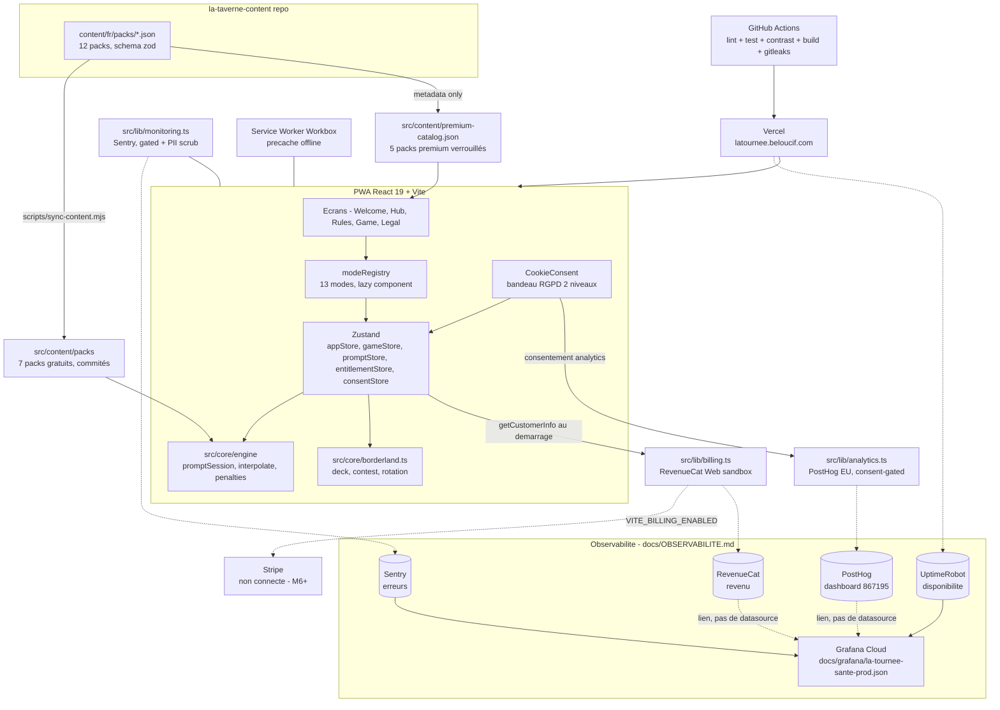

# La Tournée

[](https://github.com/Adam-Blf/la-tournee/releases)

<!-- adam-badges:start -->
[](https://github.com/Adam-Blf/la-tournee/commits) [](https://hits.sh/github.com/Adam-Blf/la-tournee/) [](https://github.com/Adam-Blf/la-tournee/commits) [](https://github.com/Adam-Blf/la-tournee) [](LICENSE)
<!-- adam-badges:end -->


Les meilleurs jeux de soirée, réunis dans une seule app. PWA installable, hors ligne. Live : [latournee.beloucif.com](https://latournee.beloucif.com)

Direction artistique **néobrutalisme** : papier crème, encre noire, aplats vifs, ombres dures. Typo Anton / Bricolage Grotesque (Google Fonts auto-hébergées). Brand book marketing : [`docs/BRAND.md`](docs/BRAND.md). Design system technique : [`design-system/la-tournee/MASTER.md`](design-system/la-tournee/MASTER.md). Palette détaillée (web + portage Android/iOS) : [`docs/DESIGN_TOKENS.md`](docs/DESIGN_TOKENS.md).

L'univers narratif du jeu (la taverne, le comptoir, le taulier, la tablée, la pénalité) reste inchangé - seul le nom du produit est devenu La Tournée (2026-08-05, ex-Meskova, ex-« La Taverne »).

L'application distribue des pénalités abstraites, le groupe décide de leur nature. Aucun contenu n'encourage la consommation d'alcool.

## Le Coupe-Gorge

**52 à 156 cartes, 4 règles, 2 jokers par paquet, 0 pitié.**

Tire une carte **face cachée**, fais deviner sa valeur, retourne-la, découvre son pouvoir.
Distribue des pénalités, ou prends-les. Conteste si tu oses. Options : 1 à 3 paquets,
jokers (carte blanche), mode cartes aléatoires à l'infini (premium).

| Couleur | Règle | Description |
|---------|-------|-------------|
| Trèfle | Le Guess | Avant de retourner la carte, un joueur devine sa valeur. S'il a juste, tu distribues. Sinon, il prend la pénalité. |
| Carreau | L'Action | Donne une action au joueur de ton choix. |
| Cœur | La Question | Pose une question au joueur de ton choix. |
| Pique | La Contrainte | Donne une contrainte à accomplir au joueur de ton choix. |

Contest avec escalade : niveau 1 = x1, niveau 2 = x2, niveau 3 = x4. **As = PÉNALITÉ MAJEURE**, autres cartes = pénalités (valeur de la carte).

## Modes de jeu

Moteur multi-modes générique (`src/core/engine`) qui pilote 13 modes depuis un registre central,
chacun avec son écran chargé en lazy loading :

| Mode | Type | Contenu |
|------|------|---------|
| Le Coupe-Gorge | Jeu de cartes dédié | 1-3 paquets + jokers, logique propre (`src/core/borderland.ts`) |
| Quitte ou Trinque | Écran dédié + moteur pur | Quiz culture G à cagnotte (`quizSession.ts`, 60 questions) |
| Le Tableau d'Honneur | Écran dédié + moteur pur | Classement secret du juge, la table devine la question (`rankingSession.ts`, 40 questions) |
| La Criée | Logique embarquée | Surenchères sur un thème, défi « tu mens ! » 60 s (50 thèmes) |
| Le Taulier (picolo) | Session de prompts | Pack gratuit + pack premium verrouillé |
| Action ou Vérité | Session de prompts | Pack gratuit + pack premium verrouillé |
| Je n'ai jamais | Session de prompts | Pack gratuit + pack premium verrouillé |
| Qui de nous | Session de prompts | Pack gratuit + pack premium verrouillé |
| Tu préfères | Session de prompts | Pack gratuit |
| C'est un 10 mais | Session de prompts | Pack gratuit + pack premium verrouillé |
| 7 Secondes | Session de prompts | Pack gratuit |
| Le Pilori | Logique embarquée | Accusations écrites par les joueurs (ou par l'app), défense, vote à main levée |
| La Roue du Destin | Logique embarquée | Roue à 8 segments + segments personnalisés (« Mes règles ») |

Le contenu (packs FR) vient du repo `la-taverne-content` : les packs gratuits sont synchronisés en
JSON commité (`npm run sync-content`), les packs premium restent hors du repo public - seule leur
métadonnée alimente les tuiles verrouillées du hub, en attendant l'entitlement d'un backend de distribution premium (M6).

## État des features

- [x] Check-in des joueurs (2-8, persistés en localStorage)
- [x] Jeu de cartes Le Coupe-Gorge complet (contest, stats, récap de session)
- [x] Moteur multi-modes (registre de 13 modes, session de prompts générique, règles persistantes/rôles)
- [x] 6 modes de prompts jouables (Le Taulier, Action ou Vérité, Je n'ai jamais, Qui de nous, C'est un 10 mais, 7 Secondes) + 7 modes embarqués (Le Coupe-Gorge, La Criée, Le Pilori, Le Tableau d'Honneur, Quitte ou Trinque, La Roue du Destin, Tu préfères à vote)
- [x] Le Tribunal et La Roue du Destin (logique embarquée, sans pack de contenu)
- [x] Pipeline de contenu (`scripts/sync-content.mjs`) + validation zod alignée sur le schéma `la-taverne-content`
- [x] Gating premium (stub `entitlementStore`, tuiles verrouillées, modale "bientôt")
- [x] Haptique + raccourcis clavier
- [x] PWA installable, mode hors ligne
- [x] Tests unitaires sur la logique de jeu et le moteur multi-modes (Vitest)
- [x] CI GitHub Actions (lint, tests, build, gitleaks)
- [x] Rebranding « La Taverne » (néobrutalisme, Archivo Black/Archivo/Space Mono, logo + jeu complet d'icônes iOS/Android)
- [x] Rebranding produit « Meskova » (2026-08-04) : nom d'app, manifest PWA, écrans, pages légales,
      migration localStorage, univers narratif (taverne, taulier, tablée) inchangé
- [x] Rebranding produit « La Tournée » (2026-08-05, ex-Meskova) : nom d'app, manifest PWA, écrans,
      pages légales, entitlement RevenueCat, domaine, migration localStorage, univers narratif
      inchangé
- [x] Refonte du thème sombre (2026-08-04) : hiérarchie d'élévation à 4 paliers, bordures
      renforcées (alpha 0.20 -> 0.38), nouveau token `danger` séparé de `card-red`, voir
      [`docs/DESIGN_TOKENS.md`](docs/DESIGN_TOKENS.md)
- [x] Navigation robuste : couche history/popstate (retour matériel in-app), fermeture des modales au retour, zéro écran noir, safe-area sur tous les contrôles fixes
- [x] Règles personnalisées « Mes règles » (persistées sur l'appareil, injectées dans les jeux)
- [x] 4 nouveaux modes : Quitte ou Trinque, Le Tableau d'Honneur, La Criée, Procès avec accusations des joueurs
- [x] Coupe-Gorge (ex-Borderland) : 1-3 paquets, jokers, mode infini premium, 52 cartes au design unique
- [x] Pages légales (mentions légales, politique de confidentialité, CGU/CGV) + bandeau de
      consentement cookies RGPD (2 niveaux, refus aussi simple que l'acceptation, `consentStore`)
- [x] Analytics produit consenti (PostHog EU, `src/lib/analytics.ts`) - zéro traceur avant choix
      explicite, événements `mode_started` / `session_completed` / `premium_paywall_viewed` /
      `consent_updated` / `subscribe_started` / `subscribe_completed` / `subscribe_failed`
      (entonnoir premium complet, voir [`docs/posthog/insights.json`](docs/posthog/insights.json))
- [x] Infra premium réelle (RevenueCat Web sandbox, `src/lib/billing.ts` + `entitlementStore`) -
      modale paywall avec prix live si disponible, achat réel désactivé derrière
      `VITE_BILLING_ENABLED` en attendant la connexion Stripe
- [x] Onboarding premier lancement (3 panneaux, une seule fois, skippable)
- [x] Règles par mode : les 13 modes documentés in-app (bouton « ? » sur chaque tuile)
- [x] Fin de session sur tous les modes (La Criée, La Roue et Tu préfères inclus)
- [x] Crash reporting Sentry (gated par `VITE_SENTRY_DSN`, erreurs uniquement, zéro PII,
      scrub `beforeSend`/`beforeBreadcrumb`, `environment` séparé du build) -
      voir [`docs/MONITORING.md`](docs/MONITORING.md)
- [x] Garde de contraste WCAG 2.1 (`scripts/check_contrast.mjs`, branché en CI) : texte sur les
      aplats pop (jaune/rose/bleu/vert) fixé sur le nouveau token `tile-ink`, plus lisible en
      thème sombre (voir [`docs/DESIGN_TOKENS.md`](docs/DESIGN_TOKENS.md))
- [x] Observabilité prod : dashboard Grafana importable (Sentry + UptimeRobot),
      insights PostHog scriptés (`npm run posthog:setup`) - runbook complet dans
      [`docs/OBSERVABILITE.md`](docs/OBSERVABILITE.md)
- [ ] Abonnement premium réel activé en production (connexion Stripe côté RevenueCat)

## Installation

```bash
git clone https://github.com/Adam-Blf/la-tournee.git
cd la-tournee
npm install
npm run dev
```

| Commande | Description |
|----------|-------------|
| `npm run dev` | Serveur de développement |
| `npm run build` | Build production (tsc + vite) |
| `npm run lint` | ESLint 9 |
| `npm run test` | Vitest (watch) |
| `npm run test:run` | Vitest (one shot, CI) |
| `npm run sync-content` | Resynchronise les packs gratuits depuis `../la-taverne-content` |
| `npm run check:contrast` | Vérifie le contraste WCAG 2.1 des paires de tokens connues (garde CI, instantanée) |
| `npm run check:contrast:visual` | Vérifie le contraste WCAG 2.1 du rendu réel (Playwright + axe-core, après `npm run build`) - voir `scripts/visual-contrast/README.md` |
| `npm run posthog:setup` | Crée/met à jour le dashboard PostHog depuis `docs/posthog/insights.json` (gated par `POSTHOG_PERSONAL_API_KEY`) |

### Variables d'environnement

Voir [`.env.example`](.env.example). Toutes optionnelles - sans elles, l'app tourne en mode
invité (pas d'analytics, paywall en "Bientôt disponible", pas de crash).

| Variable | Usage |
|----------|-------|
| `VITE_POSTHOG_KEY` | Clé publique PostHog (EU Cloud), analytics consenti |
| `VITE_POSTHOG_HOST` | Host PostHog, `https://eu.i.posthog.com` par défaut |
| `VITE_REVENUECAT_TEST_STORE_KEY` | Clé publique sandbox RevenueCat Web |
| `VITE_BILLING_ENABLED` | `true` pour activer l'achat réel (désactivé tant que Stripe n'est pas connecté dans RevenueCat) |

## Architecture



## Tech stack

| Technologie | Usage |
|-------------|-------|
| React 19 + TypeScript 5.7 | UI |
| Vite 6 | Build |
| Tailwind CSS 3.4 | Styling |
| Framer Motion 12 | Animations |
| Zustand 5 | State (persist localStorage) |
| Zod 4 | Validation des packs de contenu au chargement |
| Vitest | Tests logique de jeu et moteur multi-modes |
| vite-plugin-pwa | PWA + Service Worker |
| posthog-js | Analytics produit (EU Cloud), consent-gated |
| @revenuecat/purchases-js | Abonnement premium web (sandbox, chargé dynamiquement) |
| Vercel | Hébergement + previews |

## Déploiement

Vercel, automatique depuis `main`. Domaine : CNAME `latournee` vers `cname.vercel-dns.com` (zone DNS OVH) - l'ancien domaine `lataverne` peut rediriger.

## Changelog

Voir [CHANGELOG.md](CHANGELOG.md).

## Licence

[MIT](LICENSE) - Adam Beloucif, nom commercial BLF Lab's

---

*Buvez responsable, jouez encore plus responsable.*
