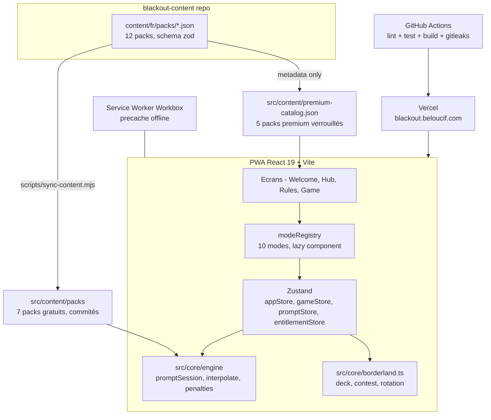

# BlackOut

[](https://github.com/Adam-Blf/black-out/releases)

<!-- adam-badges:start -->
[](https://github.com/Adam-Blf/black-out/commits) [](https://hits.sh/github.com/Adam-Blf/black-out/) [](https://github.com/Adam-Blf/black-out/commits) [](https://github.com/Adam-Blf/black-out) [](LICENSE)
<!-- adam-badges:end -->


Collection de jeux de soirée, PWA installable, hors ligne. Live : [blackout.beloucif.com](https://blackout.beloucif.com)

L'application distribue des pénalités abstraites, le groupe décide de leur nature. Aucun contenu n'encourage la consommation d'alcool.

## Le Borderland

**52 cartes, 4 règles, 0 pitié.**

Tire une carte, découvre son pouvoir. Distribue des pénalités, ou prends-les. Conteste si tu oses.

| Couleur | Règle | Description |
|---------|-------|-------------|
| Trèfle | Le Guess | Carte face cachée. Un joueur devine la valeur. S'il a juste, tu distribues. Sinon, il prend une pénalité. |
| Carreau | L'Action | Donne une action au joueur de ton choix. |
| Coeur | La Question | Pose une question au joueur de ton choix. |
| Pique | La Contrainte | Donne une contrainte à accomplir au joueur de ton choix. |

Contest avec escalade : niveau 1 = x1, niveau 2 = x2, niveau 3 = x4. **As = PÉNALITÉ MAJEURE**, autres cartes = pénalités (valeur de la carte).

## Modes de jeu

Moteur multi-modes générique (`src/core/engine`) qui pilote 10 modes depuis un registre central,
chacun avec son écran chargé en lazy loading :

| Mode | Type | Contenu |
|------|------|---------|
| Le Borderland | Jeu de cartes dédié | 52 cartes, logique propre (`src/core/borderland.ts`) |
| Le Meneur (picolo) | Session de prompts | Pack gratuit + pack premium verrouillé |
| Action ou Vérité | Session de prompts | Pack gratuit + pack premium verrouillé |
| Je n'ai jamais | Session de prompts | Pack gratuit + pack premium verrouillé |
| Qui de nous | Session de prompts | Pack gratuit + pack premium verrouillé |
| Tu préfères | Session de prompts | Pack gratuit |
| C'est un 10 mais | Session de prompts | Pack gratuit + pack premium verrouillé |
| 7 Secondes | Session de prompts | Pack gratuit |
| Le Tribunal | Logique embarquée | Accusé aléatoire, vote à main levée, verdict |
| La Roulette | Logique embarquée | Roue à 8 segments de gages/pénalités |

Le contenu (packs FR) vient du repo `blackout-content` : les packs gratuits sont synchronisés en
JSON commité (`npm run sync-content`), les packs premium restent hors du repo public - seule leur
métadonnée alimente les tuiles verrouillées du hub, en attendant l'entitlement Supabase (M6).

## État des features

- [x] Check-in des joueurs (2-8, persistés en localStorage)
- [x] Jeu de cartes Le Borderland complet (contest, stats, récap de session)
- [x] Moteur multi-modes (registre de 10 modes, session de prompts générique, règles persistantes/rôles)
- [x] 7 modes de prompts jouables (Le Meneur, Action ou Vérité, Je n'ai jamais, Qui de nous, Tu préfères, C'est un 10 mais, 7 Secondes)
- [x] Le Tribunal et La Roulette (logique embarquée, sans pack de contenu)
- [x] Pipeline de contenu (`scripts/sync-content.mjs`) + validation zod alignée sur le schéma `blackout-content`
- [x] Gating premium (stub `entitlementStore`, tuiles verrouillées, modale "bientôt")
- [x] Haptique + raccourcis clavier
- [x] PWA installable, mode hors ligne
- [x] Tests unitaires sur la logique de jeu et le moteur multi-modes (Vitest)
- [x] CI GitHub Actions (lint, tests, build, gitleaks)
- [x] Rebranding Neo-Tokyo Borderland
- [ ] Abonnement premium réel (paiement, déblocage des packs - M6)

## Installation

```bash
git clone https://github.com/Adam-Blf/black-out.git
cd black-out
npm install
npm run dev
```

| Commande | Description |
|----------|-------------|
| `npm run dev` | Serveur de développement |
| `npm run build` | Build production (tsc + vite) |
| `npm run lint` | ESLint 9 |
| `npm run test` | Vitest (watch) |
| `npm run test:run` | Vitest (one shot, CI) |
| `npm run sync-content` | Resynchronise les packs gratuits depuis `../blackout-content` |

## Architecture



## Tech stack

| Technologie | Usage |
|-------------|-------|
| React 19 + TypeScript 5.7 | UI |
| Vite 6 | Build |
| Tailwind CSS 3.4 | Styling |
| Framer Motion 12 | Animations |
| Zustand 5 | State (persist localStorage) |
| Zod 4 | Validation des packs de contenu au chargement |
| Vitest | Tests logique de jeu et moteur multi-modes |
| vite-plugin-pwa | PWA + Service Worker |
| Vercel | Hébergement + previews |

## Déploiement

Vercel, automatique depuis `main`. Domaine : CNAME `blackout` vers `cname.vercel-dns.com` (zone DNS OVH).

## Changelog

Voir [CHANGELOG.md](CHANGELOG.md).

## Licence

[MIT](LICENSE) - Adam Beloucif

---

*Jouez responsable.*
